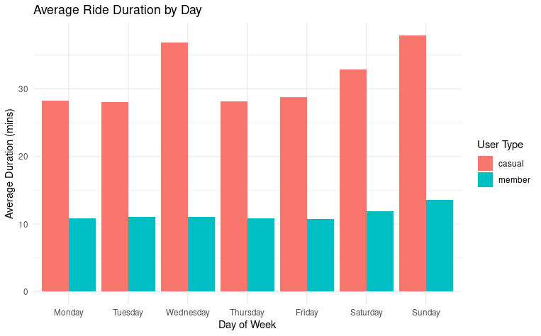
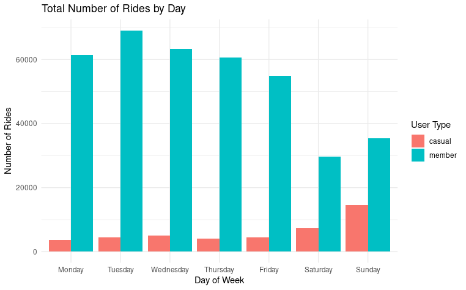

# Cyclistic Bike-Share Case Study

##  Overview

This project explores user behavior of the Cyclistic bike-share system to identify patterns that can inform marketing and retention strategies. The goal is to understand rider usage trends and recommend actions to increase rider engagement and revenue.

##  Business Problem

Objective:  
Help Cyclistic understand how casual riders convert (or don’t convert) into annual members, and identify factors that influence rider retention.

Stakeholders:  
- Marketing teams  
- Product strategy  
- Customer retention and growth

##  Data

Source:  
Cyclistic bike-share trip data provided as part of the Udacity Data Analyst Nanodegree capstone.

Content:  
Trip start and end times, member type, bike type, ride durations, and location zones.

Timeframe:  
Data spans multiple months for trend comparison.

##  Tools Used

- SQL (BigQuery) — data cleaning, joins, aggregation  
- Tableau — visualization and dashboard creation  
- Google Sheets / Excel — exploratory analysis and pivot tables  
- Markdown — project documentation

##  Process

1. Data Preparation  
   - Cleaned and transformed raw trip data  
   - Standardized and verified data types  
   - Removed incomplete records

2. Exploratory Data Analysis (EDA)  
   - Compared casual versus member usage patterns  
   - Investigated trip duration distributions
   - Analyzed trends over time and by demographics

3. Visualization  
   - Constructed charts and dashboards in Tableau  
   - Highlighted key patterns and anomalies

4. Insights & Recommendations  
   - Synthesized results into actionable business points

##  Key Insights

- Casual riders have shorter average trip duration than annual members.
- Weekend usage peaks are more common among casual riders; annual members ride more evenly throughout the week.
- Time of day and day of week significantly affect rider types.
- Seasonal trends show distinct riding patterns that marketing can leverage.

##  Recommendations

- Target weekend promotions for casual riders to convert them into annual members.
- Offer incentives around peak usage times to drive loyalty.
- Customize messaging by rider type and behavior segments.
- Experiment with trial periods based on user behavior patterns.

## Visuals

### Average Ride Duration by User Type

### Total Rides by Day of Week

##  Repo Structure

- /sql/ — SQL scripts used for analysis
- /tableau/ — Tableau workbook files (if available)
- /images/ — screenshots showing final visuals
- /README.md — project overview and documentation

##  How to Reproduce

1. Load data into BigQuery
2. Run SQL scripts in /sql/
3. Export results to CSV
4. Build or load the provided Tableau dashboards
5. Review summary visuals in /images/

##  Next Steps (Optional)

- Add segmentation analysis by age or bike type
- Use predictive modeling to forecast conversion likelihood
- Add interactive web version of dashboard
